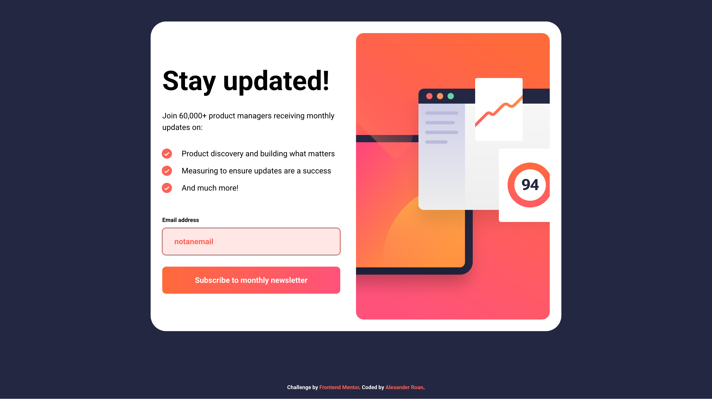
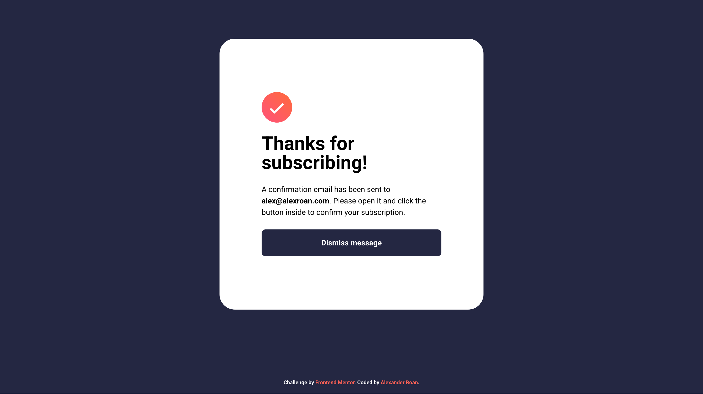
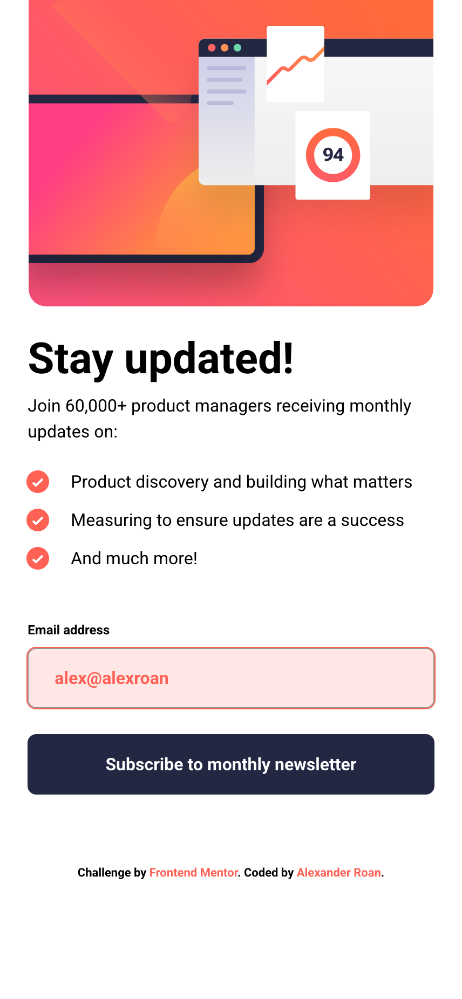

# Frontend Mentor - Newsletter sign-up form with success message solution

This is a solution to the [Newsletter sign-up form with success message challenge on Frontend Mentor](https://www.frontendmentor.io/challenges/newsletter-signup-form-with-success-message-3FC1AZbNrv). Frontend Mentor challenges help you improve your coding skills by building realistic projects.

## Table of contents

- [Overview](#overview)
  - [The challenge](#the-challenge)
  - [Screenshot](#screenshot)
  - [Links](#links)
- [My process](#my-process)
  - [Built with](#built-with)
  - [What I learned](#what-i-learned)
  - [Continued development](#continued-development)
- [Author](#author)

## Overview

### The challenge

Users should be able to:

- Add their email and submit the form
- See a success message with their email after successfully submitting the form
- See form validation messages if:
  - The field is left empty
  - The email address is not formatted correctly
- View the optimal layout for the interface depending on their device's screen size
- See hover and focus states for all interactive elements on the page

### Screenshot

### Links

- Solution URL: [GitHub](https://https://github.com/dearestalexander/fm-newsletter)
- Live Site URL: [GitHub Pages](https://dearestalexander.github.io/fm-newsletter/)

## My process

### Built with

- Semantic HTML5 markup
- CSS custom properties
- Flexbox
- CSS Grid
- Mobile-first workflow
- JavaScript

### What I learned

I did half of this challenge, then was super busy and ended up coming back to it after several months to complete it. So, it's a bit difficult to recall my process.

I did spend some time looking up the best e-mail validation approach. I decided to go with regex, and then spent some time looking at various regex options. There doesn't seem to be a perfect solution for e-mail validation, so kept it failry simple.

### Continued development

I should revisit this sometime and look at whether i can make my JS and CSS more concise.

## Author

- Website - [Alexander Roan](https://www.alexroan.com)
- Frontend Mentor - [@dearestalexander](https://www.frontendmentor.io/profile/dearestalexander)
- X: [Alexander Roan](https://x.com/alexroan_com)

